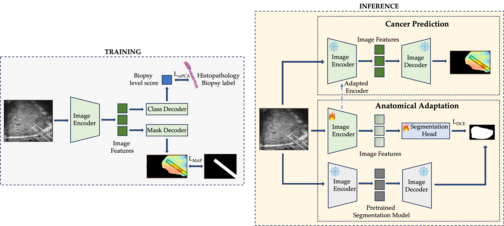

# ANT: Anatomical Alignment via Segmentation-Guided Test-Time Adaptation for Prostate Cancer Detection

ANT is a test-time adaptation framework for prostate cancer detection under multi-center domain shift in micro-ultrasound imaging. It adapts a pretrained cancer detection encoder to the target domain by solving a prostate segmentation auxiliary task at test time, using pseudo-masks generated by a frozen pretrained segmentation network.

## Installation

```bash
git clone https://github.com/ObedDzik/ant.git
cd ant
pip install -e .
```

### Requirements

- Python >= 3.9
- PyTorch >= 2.0
- MONAI >= 1.0
- See `setup.py` for full dependency list

## Environment Variables

| Variable | Required | Description |
|---|---|---|
| `WANDB_API_KEY` | No | WandB API key for experiment logging |
| `MICROSEGNET_CHECKPOINT` | **Yes** | Path to the frozen MicroSegNet prostate segmentation checkpoint |
| `DETECTION_CHECKPOINT` | **Yes** | Path to the pretrained cancer detection model checkpoint |

## Method Overview

ANT adapts a pretrained micro-ultrasound prostate cancer detection model to unseen clinical centers and scanner generations without requiring target domain labels. For each test image:

1. A frozen MicroSegNet generates a prostate pseudo-mask: `m̂ = σ(s_φ(x))`
2. A lightweight segmentation head attached to the encoder is optimised to match the pseudo-mask via a combined Dice and cross-entropy loss
3. Only the first `n` transformer blocks of the encoder are updated, targeting low-level scanner-specific signal statistics most affected by domain shift
4. After each test sample the encoder resets to its checkpoint weights, preventing cross-sample leakage; the segmentation head and its optimizer persist across the test set



## Data

ANT was developed and evaluated on a private multi-center micro-ultrasound dataset. The dataset comprises biopsy cores from multiple clinical centers with different scanner generations and acquisition protocols.

The dataset is specified via a `samples.json` file. Each case has the following structure:

```json
{
  "UA-004": {
    "case": "UA-004",
    "center": "UA",
    "age": 67,
    "psa": 6.5,
    "max_grade_group": 2.0,
    "cines": [
      {
        "cine_id": "UA-004-001",
        "image_path": ["/path/to/core_001.png"],
        "needle_mask_path": "/path/to/core_001_mask.png",
        "GG": 2.0,
        "% Cancer": 40.0
      }
    ]
  }
}
```

**Case fields:**
- `case` (str): case identifier
- `center` (str): imaging site
- `age` (int): patient age at biopsy
- `psa` (float): PSA value (ng/mL)
- `max_grade_group` (float): case-level Gleason grade group (0 = benign)

**Biopsy core fields** (`cines` list):
- `cine_id` (str): unique core identifier
- `image_path` (list of str): path(s) to biopsy B-mode PNG; the last path is used
- `needle_mask_path` (str): path to PNG needle segmentation mask
- `GG` (float): Gleason grade group (NaN or 0 = benign)
- `% Cancer` (float): percentage of core involved by cancer (NaN = benign)

The case-level cancer label is derived automatically: a case is positive if any biopsy core has GG ≥ 2 (clinically significant cancer).

## Model Architecture

The cancer detection model consists of three components:

- **Image Encoder:** DINOv3 ViT-L/16 backbone with 24 transformer blocks, pretrained on large-scale data and fine-tuned on micro-ultrasound
- **UNETR Decoder:** Hierarchical skip-connection decoder extracting features at interaction indices {4, 11, 17, 23} to produce a spatial cancer probability heatmap
- **Two-Way Transformer:** Bidirectional cross-attention module producing outputs for two task-specific decoders:
  - *Mask decoder:* dense cancer probability heatmap over the biopsy region
  - *Class decoder:* image-level classification score for clinically significant PCa

Cancer predictions at the biopsy core level are obtained by averaging heatmap activations along the biopsy needle trace mask.

## Training the Detection Model

```bash
python train.py --config configs/detection.yaml
```

Hyperparameters for training the cancer detection encoder (not needed if using a pretrained encoder, in that case go straight to test.py):

| Hyperparameter | Value |
|---|---|
| Optimizer | AdamW |
| Encoder learning rate | 1e-5 |
| Decoder learning rate | 1e-4 |
| Scheduler | Cosine annealing with 5-epoch warmup |
| Batch size | 4 |
| Epochs | 35 |
| AdamW betas | (0.9, 0.999) |
| AdamW epsilon | 1e-8 |
| Weight decay | 0.01 |
| Random seed | 30 |

**Augmentation** (training only):
- Random affine translation (max 20% displacement)
- Random resized crop to 512×512 (scale 0.3–1.0, applied with p=0.5)
- Min-max normalisation to [0, 1]

## Running ANT at Test Time

```bash
python inference.py --config configs/ant.yaml \
    --detection_checkpoint /path/to/best.pth \
    --microsegnet_checkpoint /path/to/microsegnet.pth
```

### ANT Hyperparameters

Hyperparameters were selected on a held-out source domain split (80/20 patient-level split) using core-level PCa AUC as the selection criterion.

| Hyperparameter | Value |
|---|---|
| TTA learning rate (`inner_lr`) | 1e-4 |
| Encoder learning rate | `inner_lr` × 0.1 = 1e-5 |
| Inner optimisation steps (`inner_steps`) | 10 |
| Blocks to adapt (`n`, DINOv3 ViT-L/16) | 6 (first 25%) |
| Blocks to adapt (`n`, MedSAM ViT-B) | 3 (first 25%) |
| Segmentation head hidden dim | 256 |
| TTA loss | Dice + BCE |
| Optimizer | Adam |

### Segmentation Head Architecture

The segmentation head attached to the encoder for TTA:

```python
SegHead(
    Conv2d(1024, 256, 3, padding=1) → GroupNorm(32) → ReLU
    Conv2d(256,  256, 3, padding=1) → GroupNorm(32) → ReLU
    Conv2d(256,    1, 1)
)
```

### Block Selection

Encoder blocks are partitioned into three equal groups. For DINOv3 ViT-L/16 (24 blocks):

| Group | Blocks |
|---|---|
| First third | 0 – 7 |
| Middle third | 8 – 15 |
| Last third | 16 – 23 |

ANT updates the first `n=6` blocks (blocks 0–5), targeting low-level signal statistics.

## Results

ANT achieves consistent improvements over the no-adaptation baseline and six TTA baselines (TENT, EATA, SAR, CoTTA, MEMO, ROID) across all metrics and test centers. It also improves ProstNFound+ (the current state-of-the-art model for micro-ultrasound prostate cancer detection) without architecture-specific retuning.

| Method | Patient-Level AUC csPCa (Mean) | Core-Level AUC csPCa (Mean) | Core-Level AUC PCa (Mean) |
|---|---|---|---|
| No adaptation | 78.5 | 81.5 | **72.7** |
| Best baseline (SAR) | 79.4 | 81.7 | 71.9 |
| **ANT (ours)** | **82.1** | **84.4** | **72.7** |

## Baselines

ANT is compared against the following TTA methods, all applied to the same pretrained detection encoder:

| Method | Reference |
|---|---|
| TENT | Wang et al., arXiv:2006.10726(2020) |
| EATA | Niu et al., ICML 2022 |
| SAR | Niu et al., ICLR 2023 |
| CoTTA | Wang et al., CVPR 2022 |
| MEMO | Zhang et al., NeurIPS 2022 |
| ROID | Marsden et al., CVPR 2024 |

## Citation

```bibtex
@inproceedings{dzikunu2026ant,
  title   = {Learning Prostate Anatomy at Test Time for Cancer
                Detection in Micro-Ultrasound},
  author  = {Dzikunu, Obed K. and Abootorabi, Mahdi M. and Harmanani, Mohamed and Wilson, Paul F.R. and Willis, Emma and Luger F. and Kinnaird, Adam and Wodlinger, Brian and Mousavi, Parvin and Abolmaesumi, Purang},
  booktitle = {Machine Learning for Healthcare (MLHC)},
  year    = {2026},
}
```

## License

MIT License

Copyright (c) 2026 Obed K. Dzikunu

Permission is hereby granted, free of charge, to any person obtaining a copy
of this software and associated documentation files (the "Software"), to deal
in the Software without restriction, including without limitation the rights
to use, copy, modify, merge, publish, distribute, sublicense, and/or sell
copies of the Software, and to permit persons to whom the Software is
furnished to do so, subject to the following conditions:

The above copyright notice and this permission notice shall be included in all
copies or substantial portions of the Software.

THE SOFTWARE IS PROVIDED "AS IS", WITHOUT WARRANTY OF ANY KIND, EXPRESS OR
IMPLIED, INCLUDING BUT NOT LIMITED TO THE WARRANTIES OF MERCHANTABILITY,
FITNESS FOR A PARTICULAR PURPOSE AND NONINFRINGEMENT. IN NO EVENT SHALL THE
AUTHORS OR COPYRIGHT HOLDERS BE LIABLE FOR ANY CLAIM, DAMAGES OR OTHER
LIABILITY, WHETHER IN AN ACTION OF CONTRACT, TORT OR OTHERWISE, ARISING FROM,
OUT OF OR IN CONNECTION WITH THE SOFTWARE OR THE USE OR OTHER DEALINGS IN THE
SOFTWARE.